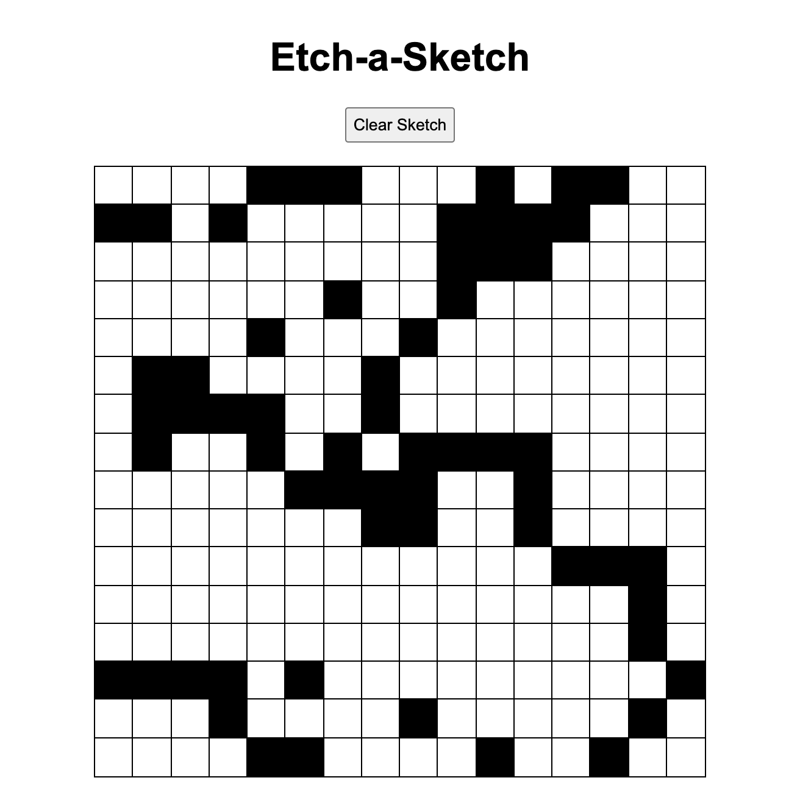

# The Odin Project 2021

## Project: Etch-A-Sketch

**Task**: Build a browser version of something between a sketchpad and an Etch-A-Sketch

**Frameworks and languages**: JavaScript, HTML, CSS

[Reference](https://www.theodinproject.com/paths/foundations/courses/foundations/lessons/etch-a-sketch-project)

## Live Demo

